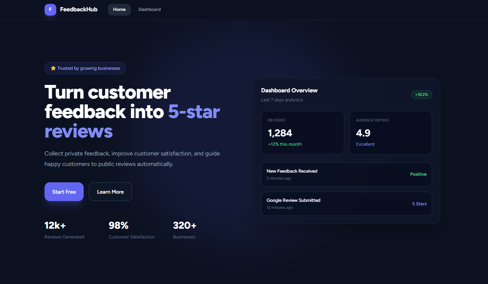
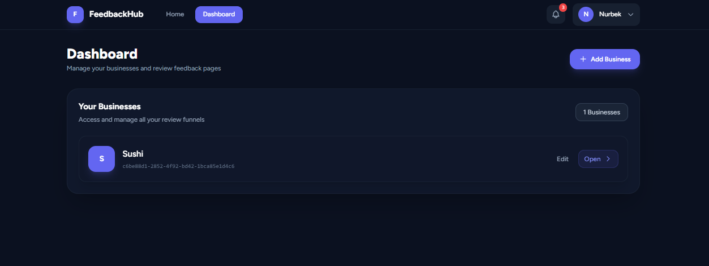
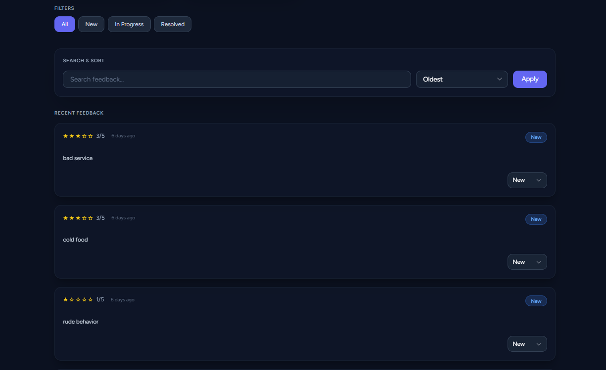

# FeedbackHub

Modern customer feedback and review management platform built with Laravel.

FeedbackHub helps businesses collect customer feedback, manage reviews, and generate shareable review links through a clean and mobile-friendly dashboard.

---

## ✨ Features

- Business dashboard
- Customer review collection
- Google & Naver review links
- Shareable feedback pages
- Notification system
- Mobile responsive UI
- Profile management
- Secure authentication
- Clean modern interface

---

## 🛠 Tech Stack

- Laravel
- Tailwind CSS
- Alpine.js
- MySQL
- Blade Components

---

## 📸 Screenshots

### Landing Page



---

### Businesses Page



---

### Dashboard




---

### Review Page


---

## 🚀 Installation

```bash
git clone https://github.com/Nurbekprodev/feedbackHub.git

cd feedbackhub

composer install

cp .env.example .env

php artisan key:generate

php artisan migrate

npm install

npm run build

php artisan serve
```

---

## ⚙️ Environment Setup

Configure your `.env` file:

```env
APP_NAME=FeedbackHub

DB_DATABASE=feedbackhub
DB_USERNAME=root
DB_PASSWORD=
```

---

## 🔗 Live Demo

[Visit FeedbackHub](https://your-link.com)

---

## 📂 Project Structure

```text
resources/
├── views/
├── css/
└── js/

routes/
├── web.php

app/
├── Models/
├── Http/
└── Notifications/
```

---

## 📄 License

MIT License

```
